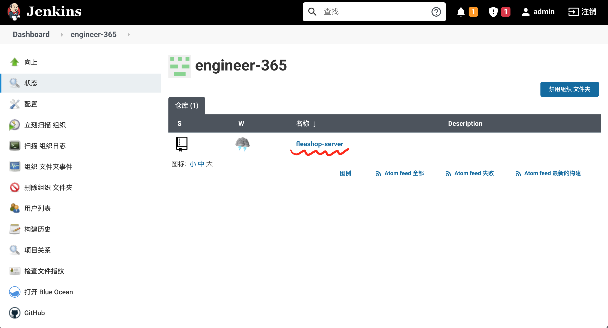

# 创建Jenkins Multibranch Github PR Job

  我们使用Jenkins的github-branch-source-plugin插件 (https://docs.cloudbees.com/docs/cloudbees-ci/latest/cloud-admin-guide/github-branch-source-plugin)来创建Multibranch PR job。这个插件创建的Jenkins job能够：

  > 1. Importing GitHub pull requests
  > 2. Creating a GitHub Organization  
  > 3. Selecting GitHub Organization credentials
  > 4. Using build triggers and webhooks in a GitHub Organization
  > 5. Controlling what is built in a GitHub Organization
  （以上内容摘自该插件官方文档）

  借助这个插件，我们可以做到：
  1. GITHUB上的PR会通过web hook触发Jenkins的构建动作
  2. 构建成功，Jenkins会通知GITHUB，把该PR的status标注为通过，只有构建通过才允许合并

## PR Job的创建步骤

1. 在Jenkins上，选择“Dashboard"/"新建任务"，在“输入一个任务名称”中找到“GitHub组织”，如下图所示：   
   

   下一步，选择连接GITHUB的凭据，如下图所示：
   
    
   完成后，Jenkins会立刻扫描Github组织里的所有仓库，为每一个包含有`Jenkinsfile`的仓库建立一个pipeline构建job，譬如如下图所示：
   
    
   上图中，Jenkins在`engineer-365`里发现了`fleashop-server`这个仓库有`Jenkinsfile`，扫描结束后我们会看到Jenkins里新建了一个`engineer-365`目录，这个目录有了一个`fleashop-server`的pipeline，如下图所示：   
   

   同时，一个新的构建已经开始执行，如下图所示：   
   

2. 在GITHUB中设置Web Hook，以便有新PR和PR变更时能自动触发Jenkins的自动构建：
   
   1. 选择仓库的“Settings" / "Webhooks"，点击“Add webhook”，添加Jenkins的webhook URL，例如`https://builder.engineer365.org:40443/github-webhook/`，如下图所示：   
      

      添加时，在"Which events would you like to trigger this webhook?"中选择“Let me select individual events.“，然后勾选“Pull requests”和“Pushes”两类events，如下图所示：
      

   2. 选择仓库的“Settings” / "Branches"，为`main` branch添加`protection rules`，如下图所示：
      

      设置`protection rules`，需确保勾选以下5个checkbox:
      - `Require pull request reviews before merging`
      - `Dismiss stale pull request approvals when new commits are pushed`
      - `Require status checks to pass before merging`
      - `continuous-integration/jenkins/pr-merge`
      - `Require branches to be up to date before merging`
      
      如下图所示：
      

3. 最后，就可以在这个GITHUB仓库里新建一个PR，验证设置是否成功，构建中时PR状态如下图所示：
   
   
   点击“Details”时，默认会跳转到Jenkins的Blue Ocean，如下图所示：
   
   
   构建成功后，PR状态分别如下图所示，此时PR如果被approve了的话，就可以merge了：
   

