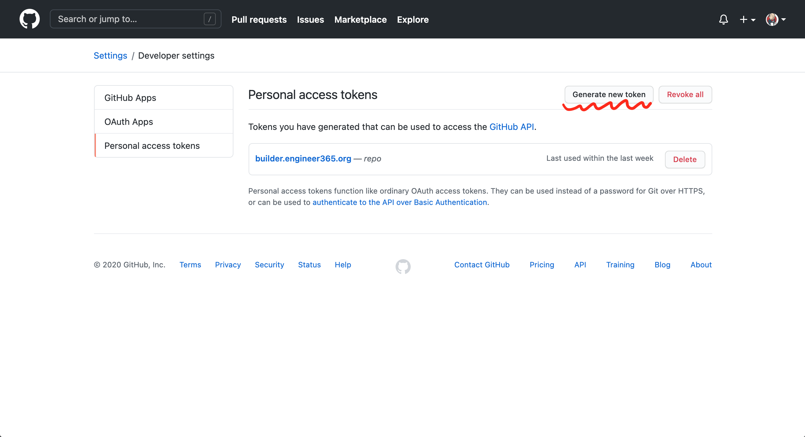

# Builder虚拟机 - Jenkins ...

## 初始化启动
  ```shell
  ./up.sh

  # 获取admin初始化密码，
  vagrant ssh -c "sudo cat /var/lib/jenkins/secrets/initialAdminPassword"
  # 譬如：aee27d4d95a84b7c93f784da36fd5840

  # 验证：http://192.168.50.121:8080是否能否访问
  # 外部访问需要用反向代理，譬如https://builder.engineer365.org:40443
  ```

  浏览器访问时，使用上述密码登录，然后立刻修改admin密码
  
  1. 点击右上角“admin”，左侧菜单选择“设置”，往下滚动，找到“密码”，然后输入新的密码和确认密码，如下图所示：
     
   
     点击“保存”按钮，重新登录。

  2. 连接github.com（TODO：用命令行或CASC实现）

     1. 为每个github organization新注册一个jenkins专用的GITHUB用户，然后在GITHUB上的该用户的“Settings” / “Developer settings“ / “Personal access tokens”页面中，生成一个新的access token，只赋予这个token以repo权限。注意，这个token只会在生成时看得到，所以需复制保存下来，生成的token就是我们设置Jenkins时需要的“密码”。如下图所示：
        
        

     2. 回到Jenkins，选择“Dashboard”/“系统管理”，如下图所示:
        
     
     3. 往下滚动，找到“GitHub”，选择“添加Github服务器”，如下图所示：
        
     
     4. 选择“添加”/“Jenkins”，打开“Jenkins凭据提供者：Jenkins”，输入“用户名”、”密码“和”ID“，
        “用户名”即前面步骤中新注册的jenkins专用的GITHUB用户名：
        
        

        然后，点击“添加”按钮关闭添加凭据对话框，最后，点击“保存”按钮。

  3. builder虚拟机的初始化至此完成。关于新建一个Jenkins Job等，参见 [../../jenkins/README.md](../../jenkins/README.md)

## 部分jenkins docs的链接
  - https://www.jenkins.io/projects/jcasc/
  - https://github.com/jenkinsci/configuration-as-code-plugin
  - https://www.jenkins.io/doc/book/managing/groovy-hook-scripts/
  - https://plugins.jenkins.io/maven-plugin/
  - https://plugins.jenkins.io/docker-workflow/
  - https://www.jenkins.io/doc/book/pipeline/
  - https://plugins.jenkins.io/workflow-aggregator/
  - https://www.jenkins.io/doc/book/blueocean

## 制作镜像

  `./build.sh`
